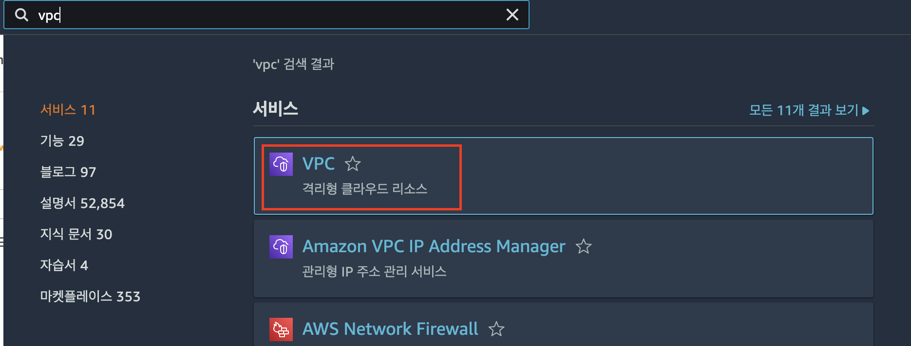
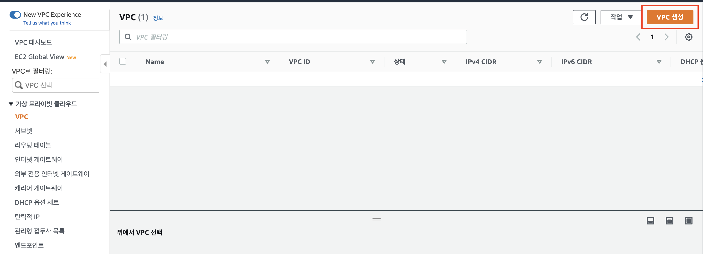
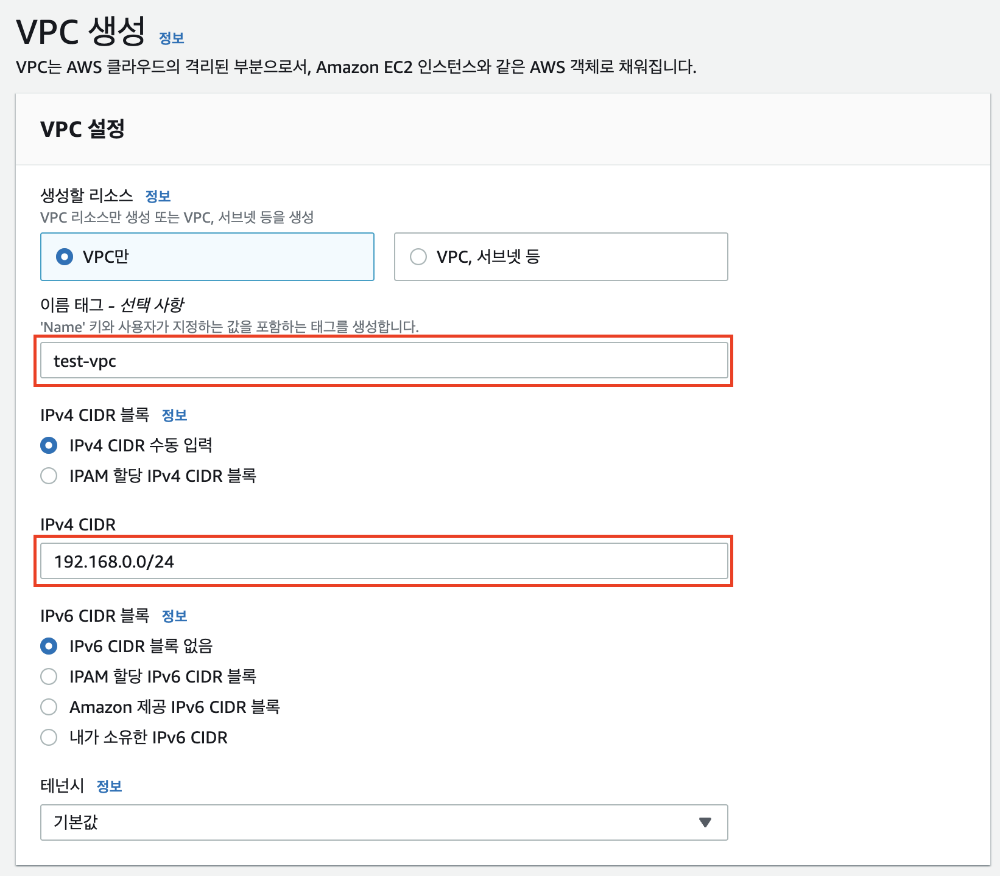
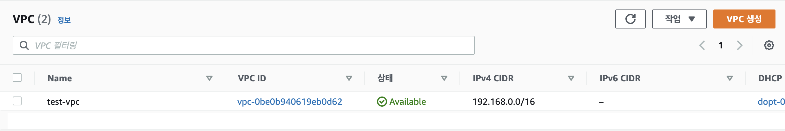

### 망 분리 이유
인터넷과 통신하는 외부망, 데이터베이스 등을 띄워두는 내부망, 외부망과 내부망에 접근하기 위한 관리용 망\

## VPC로 망 분리하기
### VPC 생성하기
우선 망을 분리할 가상 네트워크인 VPC를 생성해야 한다.
1. 먼저 AWS 웹 콘솔에 로그인 후 VPC 서비스를 찾아 들어간다.

2. VPC 서비스 페이지에서 `VPC 생성` 버튼을 클릭한다.

3. 이름 태그와 IPv4 CIDR 대역폭을 지정하고, VPC를 생성한다.

이때 CIDR 크기는 [공식 문서](https://docs.aws.amazon.com/ko_kr/vpc/latest/userguide/working-with-vpcs.html#Create-VPC)에 따라 `/16 ~ /28` 사이여야 하며, 
IP는 [RFC 1918](http://www.faqs.org/rfcs/rfc1918.html) 규격에 따라 프라이빗 IP 주소 범위에 속하는 CIDR 블록을 지정하는 것이 좋다. (예: 10.0.0.0/16, 172.16.0.0/16, 192.168.0.0/16 등)
4. VPC를 생성하고, VPC 서비스 대시보드에서 정상적으로 생성됐음을 확인한다.

### VPC에 서브넷 생성하기
VPC를 생성하고 인터넷과 통신할 외부망, 데이터베이스 등이 연결될 내부망, 그리고 외부망과 내부망에 접근할 수 있는 관리망에 대한 서브넷을 생성해야 한다.
1. 

### 외부망 서브넷 인터넷과 연결하기
