### 망 분리 이유
보안적인 이로움을 얻는 등에 대한 이유도 있지만, 관심사를 분리하여 우리가 집중할 대상에 보다 집중하기 위함도 있다고 한다.\
\
아래에서 설명할 내용은 총 세 가지의 네트워크 망을 구성한다.
1. 인터넷과 통신할 수 있는 외부망
2. 데이터베이스 등에 접근할 수 있는 내부망
3. 그리고 외부망과 내부망을 관리할 수 있는 관리망

위처럼 네트워크 망을 분리하게 되면, 데이터베이스 등 중요한 자원들은 내부망에서만 관리하도록 한정지을 수 있다. 
외부망은 인터넷과 통신하는 역할만 갖고, 내부망에는 쉽게 접근할 수 없도록 제어할 수 있다. 
또한 외부망과 내부망은 관리망을 통해서만 접근 가능하도록 설정하고, 관리망의 IP를 내 IP 혹은 회사 IP 등으로 한정짓는다면 더 안정적인 환경을 구성할 수 있다.

## VPC와 서브넷 설정하기
### VPC 생성하기
우선 망을 분리할 가상 네트워크인 VPC를 생성해야 한다.
1. 먼저 AWS 웹 콘솔에 로그인 후 VPC 서비스를 찾아 들어간다.

2. VPC 서비스 페이지에서 `VPC 생성` 버튼을 클릭한다.

3. 이름 태그와 IPv4 CIDR 대역폭을 지정하고, VPC를 생성한다.

이때 CIDR 크기는 [공식 문서](https://docs.aws.amazon.com/ko_kr/vpc/latest/userguide/working-with-vpcs.html#Create-VPC)에 따라 `/16 ~ /28` 사이여야 하며, 
IP는 [RFC 1918](http://www.faqs.org/rfcs/rfc1918.html) 규격에 따라 프라이빗 IP 주소 범위에 속하는 CIDR 블록을 지정하는 것이 좋다. (예: 10.0.0.0/16, 172.16.0.0/16, 192.168.0.0/24 등)
4. VPC를 생성하고, VPC 서비스 대시보드에서 정상적으로 생성됐음을 확인한다.

### VPC에 서브넷 생성하기
VPC를 생성하고 인터넷과 통신할 외부망, 데이터베이스 등이 연결될 내부망, 그리고 외부망과 내부망에 접근할 수 있는 관리망에 대한 서브넷을 생성해야 한다.
1. 서브넷을 생성하기 위해 VPC 서비스 사이드바에서 `서브넷` 대시보드에 접근한 후 `서브넷 생성` 버튼을 클릭한다.
  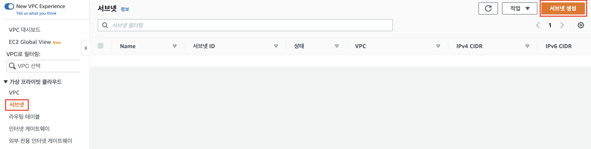
2. 서브넷 생성 페이지에서 서브넷을 생성할 VPC를 지정해준다.
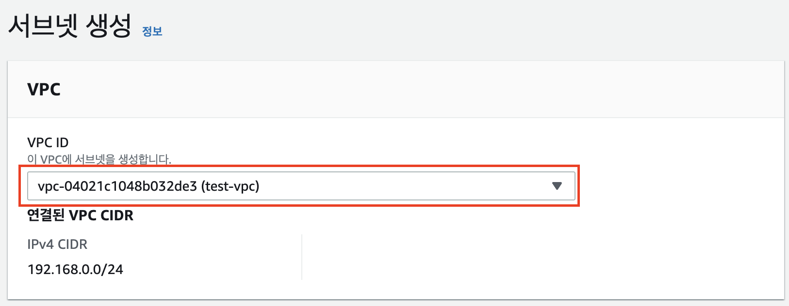
3. 서브넷 설정 섹션에서 외부망, 내부망, 관리망에 해당하는 서브넷을 설정한다.
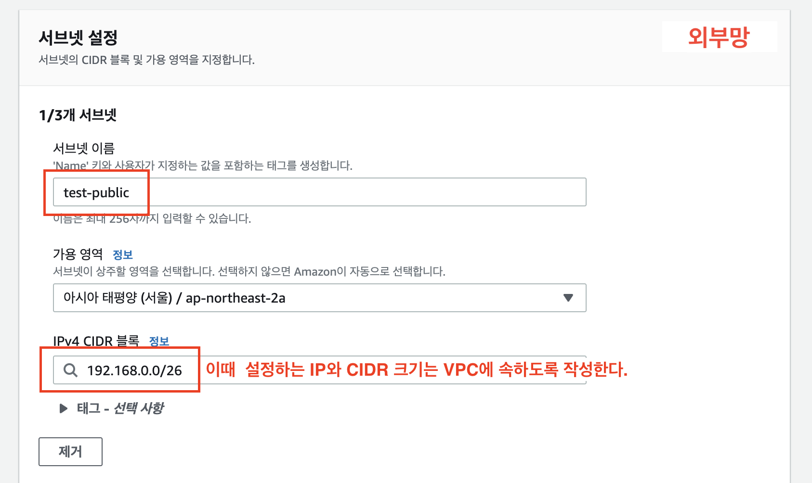
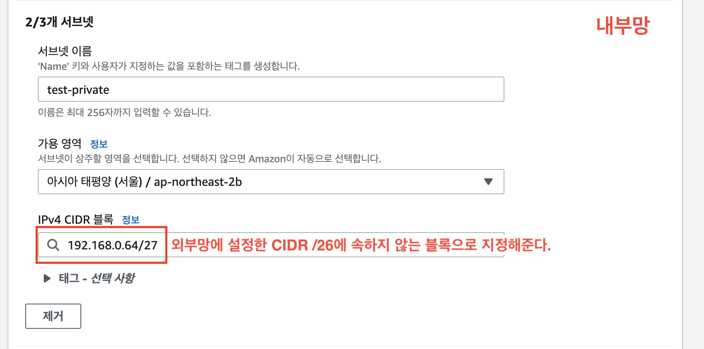
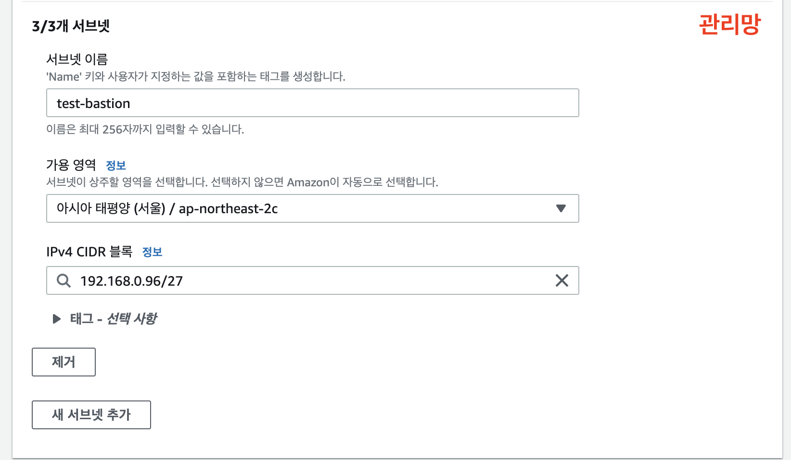
4. 설정한 서브넷을 생성하고, 대시보드에서 정상적으로 생성됐음을 확인한다.
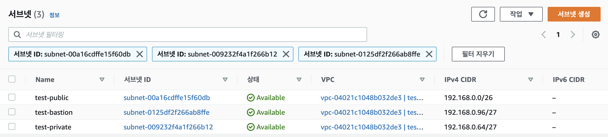

## EC2와 VPC 연결하기
서브넷을 생성했으니, 이 서브넷을 적용할 가상 서버인 EC2에 할당해준다.
### 관리망
외부망과 내부망에 대한 ssh 연결 제한을 위해 관리망을 먼저 생성한다.
1. 네트워크 설정에서 알맞은 VPC를 선택하고 **관리망**에 해당하는 서브넷을 할당해준다.
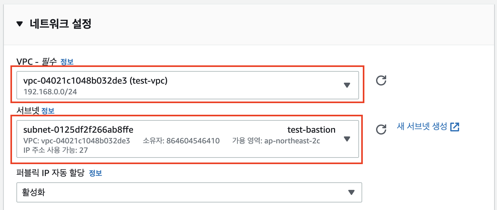
  이때 ssh 연결을 위해 **퍼블릭 IP 자동 할당은 활성화로 설정한다**
2. ssh 접근이 가능하도록 설정할 IP를 할당해준다.
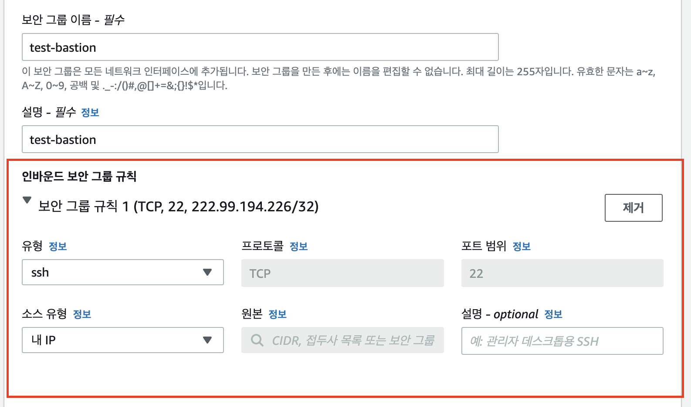
3. 생성 후 EC2 대시보드에서 관리망 인스턴스의 프라이빗 IPv4 주소를 복사한다.
(서브넷 생성 시 설정한 관리망 CIDR 블록에 포함된 IP인지 확인한다.)
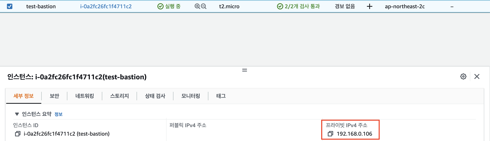
### 외부망
1. 네트워크 설정에서 알맞은 VPC를 선택하고 외부망에 해당하는 서브넷을 할당해준다. 
  이때 ping 테스트를 위해 **퍼블릭 IP 자동 할당은 활성화로 설정한다**
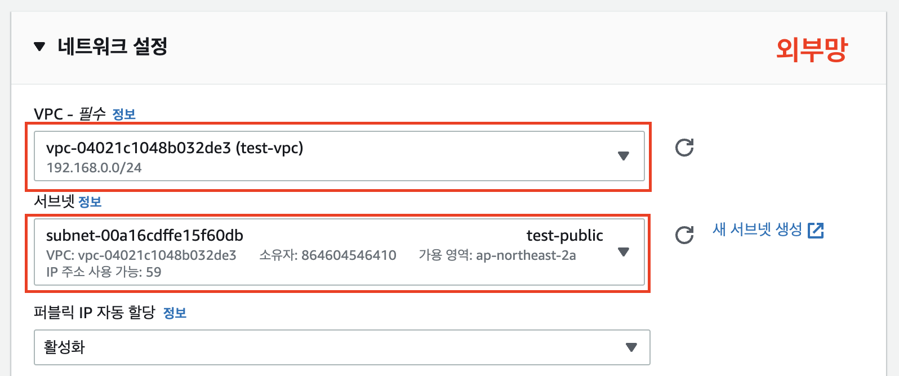
2. 추가로 ping 테스트를 위해 보안그룹 인바인드 규칙에 `모든 ICMP - IPv4`를 추가하고, 관리망 프라이빗 IP에 대한 ssh 인바운드 규칙도 추가한 후 인스턴스를 생성한다.
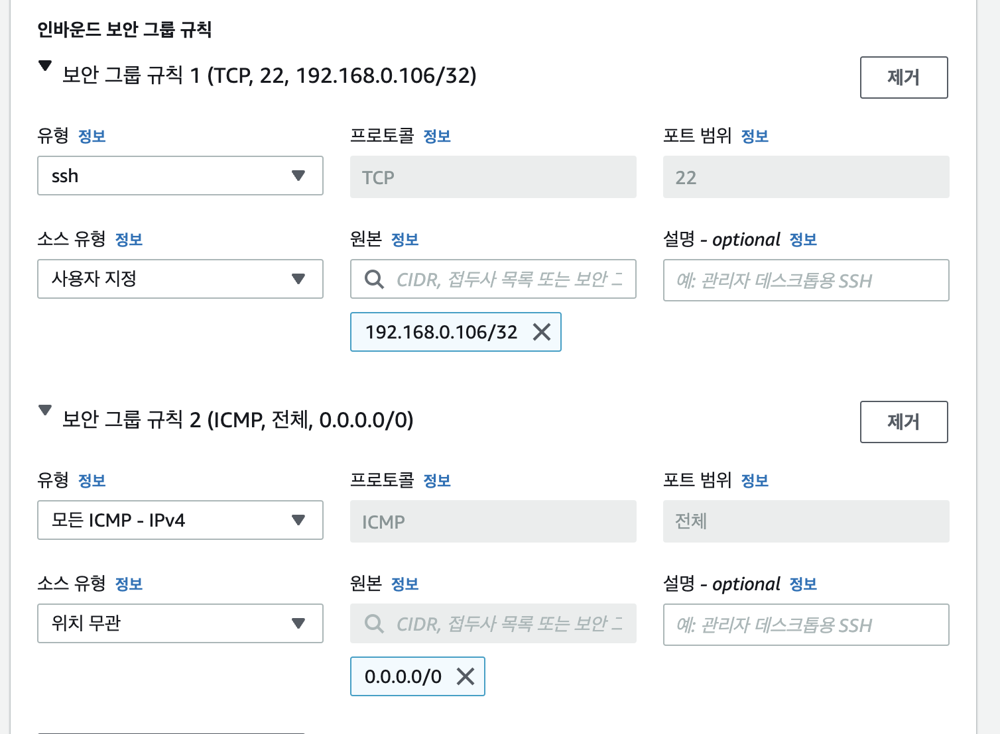
### 내부망
1. 네트워크 설정에서 알맞은 VPC를 선택하고 내부망에 해당하는 서브넷을 할당해준다.
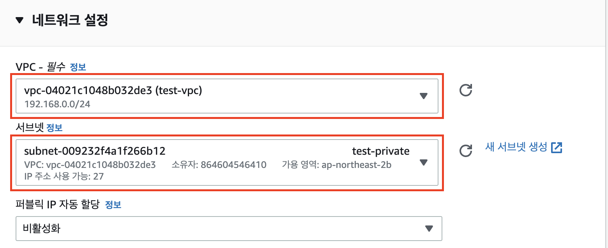
2. 관리망에서 ssh 접근이 가능하도록 ssh 인바운드 규칙을 추가한 후 인스턴스를 생성한다.
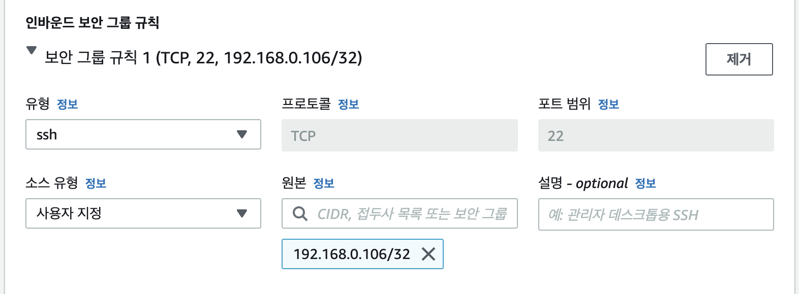

EC2 인스턴스를 모두 생성한 후 대시보드에서 정상적으로 생성됐음을 확인한다.

### 외부망 서브넷 인터넷과 연결하기
외부망 서브넷을 할당한 EC2 인스턴스
