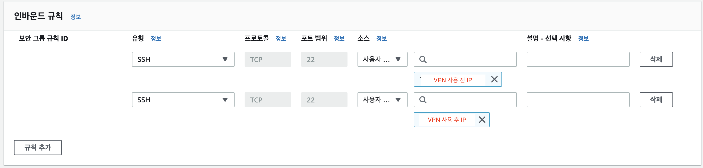

### 문제상황
휴대폰 핫스팟을 이용하여 개인 노트북으로 AWS EC2 인스턴스에 접근하려고 했는데,\
\

\
\
사진처럼 `타임 아웃(timed out)` 에러가 발생했습니다.\
\
이전에 보안 그룹을 제대로 설정하지 않았을 때도 확인됐던 오류라서 당연히 보안 그룹을 재설정하려고 했습니다.\
\
   
\
\
하지만 이미 **내 아이피**로 할당이 되어 있었고 이유를 몰라서 거진 두 시간 동안 ssh 포트를 변경하는 등 여러 삽질을 하고, 결국 회사 팀원분께 도움을 받아 해결할 수 있었습니다.\
\
### 해결방법
1. 우선 휴대폰 핫스팟을 사용 중인 맥북에 **VPN**을 설치하고, 연결합니다.
2. 그 후 변경된 IP를 SSH 접속하려는 EC2 인스턴스 보안그룹에 등록합니다.(가끔 IP가 변경되지 않을 경우가 있는데, 새로고침 후 다시 등록해야 합니다.)
   
3. 그리고 SSH 연결을 다시 시도하면 성공적으로 연결되는 것을 확인할 수 있습니다.
   

삽질한 것치곤 간단하게 **VPN** 연결만으로 끝낼 수 있었습니다 👏